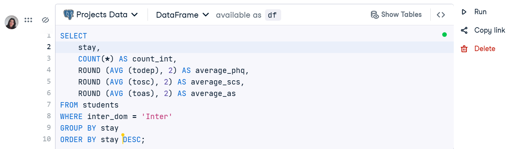
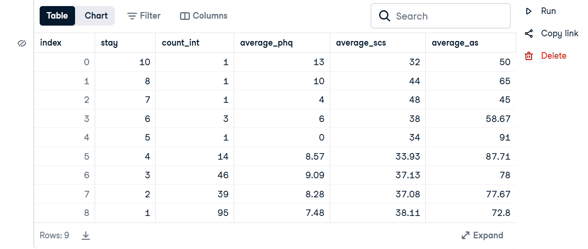

# Mental Health Analysis of International Students

## Project

This project analyzes how the duration of stay affects the mental health scores of international students using SQL and PostgreSQL.

## Objective

The objective is to determine whether the length of stay influences:

- Depression score (PHQ-9)
- Social connectedness score (SCS)
- Acculturative stress score (ASISS)

## Technologies

- PostgreSQL
- SQL

## Skills Demonstrated

- SELECT
- WHERE
- GROUP BY
- COUNT
- AVG
- ROUND
- ORDER BY

## Dataset

DataCamp Project: Analyzing Students’ Mental Health

## Repository Contents

- mental_health_analysis.sql – SQL query used for the analysis.
- README.md – Project documentation.

